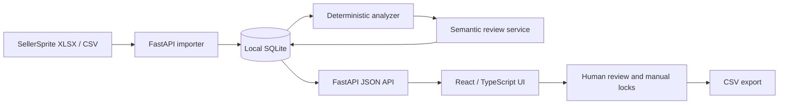

# Keyword Grove · Amazon Keyword Operations Workbench

[](https://github.com/daviesjoin-afk/amazon-keyword-grove/actions/workflows/ci.yml)

**English** · [简体中文](./README.zh-CN.md)

**Version 0.3.2 · MIT License · Local-first · Human-in-the-loop**

Keyword Grove is a local-first Amazon keyword research and advertising-recommendation workbench built around SellerSprite exports, competitor ASIN evidence, deterministic rules, and optional MiMo/OpenAI-compatible semantic review.

It is designed as a **decision-support system, not an ad-execution bot**. The application organizes keyword evidence, produces reviewable targeting/negative-keyword drafts, preserves human overrides, and exports CSV files for manual downstream use.

> **Safety boundary:** Keyword Grove does not connect to Amazon Ads and never auto-executes targeting, bidding, or negative-keyword actions.

## For reviewers

This repository is intentionally structured so that an external reviewer can evaluate the engineering decisions without access to private Amazon business data.

### What this project demonstrates

- **Product judgment:** turns noisy competitor keyword exports into a multi-product research workflow instead of a one-off spreadsheet script.
- **Human-in-the-loop AI:** semantic review supplements deterministic rules; it does not silently override safety constraints or manual locks.
- **Secret-safe integration:** AI credentials stay in the local SQLite database and API responses expose only masked metadata.
- **Fail-safe recommendations:** weak evidence, low search volume, low competitor coverage, and overly broad intent are downgraded to observation rather than promoted into spend.
- **Auditable decisions:** keyword evidence, semantic score, confidence, risk, source ASINs, review state, and history are retained for review.
- **Reproducible engineering:** backend dependency checks, compile validation, pytest, frontend Vitest, TypeScript, and production builds run in CI.
- **Local-first privacy model:** real SellerSprite exports, customer/business datasets, logs, local databases, and API keys are excluded from the public repository.

### Review path

For a fast technical review, start with:

1. [`docs/ARCHITECTURE.en.md`](./docs/ARCHITECTURE.en.md) — architecture, trust boundaries, data lifecycle, and known limitations.
2. [`backend/app/ai_service.py`](./backend/app/ai_service.py) — masked AI configuration, OpenAI-compatible transport, bounded review concurrency, and semantic-review helpers.
3. [`backend/app/analyzer.py`](./backend/app/analyzer.py) — deterministic keyword/recommendation rules and safety-oriented fallbacks.
4. [`backend/tests/`](./backend/tests/) — API, import, recommendation, secret-handling, concurrency, and regression coverage.
5. [`frontend/src/components/AISettingsPage.test.tsx`](./frontend/src/components/AISettingsPage.test.tsx) — rendered UI tests for key masking and secret-preservation behavior.
6. [`.github/workflows/ci.yml`](./.github/workflows/ci.yml) — the repository validation gate.

## Problem and workflow

Amazon keyword research often starts with multiple SellerSprite reverse-ASIN exports. The useful signal is distributed across repeated keywords, competitor coverage, search volume, product copy, and operator judgment. Keyword Grove turns those files into a persistent, reviewable local workspace.

Typical flow:

1. Create a product workspace with title, bullets, category, and core terms.
2. Import SellerSprite `.xlsx`, `.xlsm`, or `.csv` exports from competitor ASINs.
3. Normalize and merge keywords while retaining source/evidence history.
4. Run deterministic relevance and advertising-safety rules.
5. Optionally run MiMo/OpenAI-compatible semantic review in bounded network batches.
6. Review, edit, or manually lock decisions.
7. Export approval-ready CSV drafts for manual use.

## Core capabilities

- Isolated keyword libraries for multiple products and competitor-ASIN sources.
- Dynamic SellerSprite header recognition instead of fixed column positions.
- Incremental imports with history and evidence retention.
- Product copy management: custom name, title, bullets, description, search terms, and inferred multi-word core terms.
- Strong / medium / weak / irrelevant classification plus root analysis.
- Relevance expressed as competitor-ASIN coverage (for example `5/20`) alongside a separate 0–100 semantic score.
- Optional MiMo v2.5 / OpenAI-compatible semantic review with persisted review state.
- Bounded semantic-review concurrency for remote model calls while SQLite writes remain deterministic and single-threaded.
- Advertising drafts for **exact**, **broad**, **negative exact**, **negative phrase**, and **observe**. Phrase targeting is intentionally not proposed.
- Stricter safeguards for broad targeting and negative-phrase recommendations.
- CSV export without any Amazon Ads API execution.

## Design principles

1. **Local-first** — imported business data and AI configuration stay on the local machine.
2. **Human-in-the-loop** — rules and semantic review produce drafts; manual decisions can be locked and preserved.
3. **Fail-safe by default** — uncertain or weak evidence is downgraded rather than aggressively monetized.
4. **Auditable** — reasons, confidence, risk, source ASINs, review state, and history are retained.
5. **Reproducible** — frozen frontend lockfile plus backend/frontend CI gates make the project independently verifiable.
6. **No hidden automation** — the project does not call Amazon Ads, modify bids, create targets, or execute negatives.

## Architecture



Technology stack:

- **Backend:** FastAPI, SQLite, openpyxl, pytest
- **Frontend:** React 18, TypeScript, Vite, Vitest
- **Local ports:** frontend `5173`, backend `8765`

See [`docs/ARCHITECTURE.en.md`](./docs/ARCHITECTURE.en.md) for module responsibilities, trust boundaries, review concurrency, and current technical debt.

## Quick start

Requirements: Python 3.11+, Node.js 20+, and pnpm 9.15.x.

```powershell
git clone https://github.com/daviesjoin-afk/amazon-keyword-grove.git
cd amazon-keyword-grove

# Backend
python -m venv backend\.venv
backend\.venv\Scripts\python.exe -m pip install -r backend\requirements.txt

# Frontend
corepack enable
Push-Location frontend
pnpm install --frozen-lockfile
Pop-Location

# Start both local services
.\start.ps1
```

Then open:

- UI: `http://127.0.0.1:5173`
- API docs: `http://127.0.0.1:8765/docs`

## Verification

Run the same high-value checks expected by CI:

```powershell
backend\.venv\Scripts\python.exe -m compileall -q backend
backend\.venv\Scripts\python.exe -m pip check
backend\.venv\Scripts\python.exe -m pytest backend\tests -q

Push-Location frontend
pnpm test
pnpm build
Pop-Location
```

Frontend CI does not allow an empty test suite to pass. Pull requests and pushes to `main` run backend and frontend validation in GitHub Actions.

## Data and credential safety

The default application database is `backend/data/keyword-grove.db` and may be overridden with `KEYWORD_DB_PATH`.

The repository ignores local databases, logs, `.env`, virtual environments, build output, and other generated files. Real SellerSprite exports, customer/business data, screenshots containing private data, and AI API keys must not be committed or pasted into public issues or pull requests.

AI API keys are configured through the local UI. Read APIs return only `api_key_set` and a masked suffix hint; they do not return the plaintext secret.

See [`SECURITY.md`](./SECURITY.md) for the reporting policy.

## Known scope and limitations

- The current deployment model is a local single-user application; SQLite should not be treated as a multi-tenant server database.
- Semantic review is an auxiliary decision layer, not a guarantee of advertising performance.
- Advertising recommendations are drafts for human review, not execution instructions.
- The project currently focuses on US-English Amazon keyword workflows, while the UI is being made switchable between English and Simplified Chinese.
- Remaining architecture debt is documented rather than hidden; see [`docs/ARCHITECTURE.en.md`](./docs/ARCHITECTURE.en.md#current-technical-debt).

## Additional documentation

- [Architecture — English](./docs/ARCHITECTURE.en.md)
- [架构说明 — 中文](./docs/ARCHITECTURE.md)
- [Security policy](./SECURITY.md)
- [Contributing](./CONTRIBUTING.md)
- [Product requirements — Chinese](./PRD-亚马逊关键词库管理工具.md)
- [Changelog](./CHANGELOG.md)
- [v0.3.2 release notes](./docs/releases/v0.3.2.md)

## License

MIT License. See [`LICENSE`](./LICENSE).
