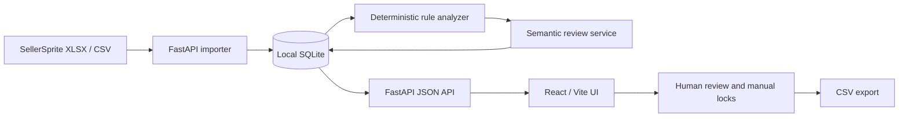

# Keyword Grove Architecture

[中文](./ARCHITECTURE.md) · **English**

## Goal

Keyword Grove is a **local-first** Amazon keyword-library and advertising-recommendation workbench. The design goal is not automatic campaign execution. It turns SellerSprite-style keyword evidence into explainable, reviewable, exportable recommendation drafts.

## System boundary

The project does not connect directly to Amazon Ads and does not automatically create targets, change bids, or execute negative keywords.

## Backend

Primary responsibilities under `backend/app/`:

- `main.py` — FastAPI application setup, public routes, transaction boundaries, and product/keyword workflow orchestration.
- `api_support.py` — API response shaping, query filters, Pydantic compatibility helpers, and manual-edit validation.
- `ai_service.py` — AI configuration loading/masking, OpenAI-compatible requests, connection checks, bounded semantic-review batch concurrency, retries, and semantic helper logic.
- `importer.py` — SellerSprite workbook/CSV header detection, field cleaning, and incremental import behavior.
- `analyzer.py` — deterministic keyword relevance, core-root inference, and advertising recommendation rules.
- `db.py` — SQLite initialization, connections, transactions, and persistence helpers.
- `schemas.py` — API request models.
- `utils.py` — text, numeric, currency, percentage, and keyword normalization helpers.

`main.py` intentionally keeps route orchestration and SQLite transaction boundaries while reusable API helpers and AI transport are separated into dedicated modules. This keeps public API behavior stable while allowing later migration into smaller routers/services.

### Semantic-review concurrency model

Remote model calls and local persistence are deliberately separated.

Independent model batches may run concurrently in a **bounded thread pool** with limited retries. SQLite writes remain single-threaded and deterministic in original batch order. A successful model batch may be persisted even if another batch fails; failed batches remain pending and are explicitly reported rather than being incorrectly marked reviewed.

This design avoids concurrent SQLite transactions while still improving network-bound review throughput.

The local database is treated as the single durable source of application state. Tests use isolated temporary databases and do not touch real user data.

## Frontend

`frontend/src/` uses React, TypeScript, and Vite:

- `api/client.ts` — backend access, pagination, and frontend model normalization.
- `api/mock.ts` — demonstration data for local/mock operation.
- `components/` — products, import flow, keyword library, root analysis, AI settings, and advertising suggestions.
- `i18n.tsx` — lightweight English / Simplified Chinese UI language state and persistence.
- `types.ts` — frontend domain models.

The default API base is `http://127.0.0.1:8765/api` and can be overridden with `VITE_API_BASE_URL`.

## Data lifecycle

1. The user creates a product workspace locally.
2. SellerSprite `.xlsx`, `.xlsm`, or `.csv` exports are imported.
3. The importer dynamically maps headers, normalizes values, and retains required evidence/history.
4. Deterministic rules calculate relevance and safety-oriented advertising recommendations.
5. Optional MiMo/OpenAI-compatible semantic review adds semantic evidence, rationale, and confidence.
6. The user reviews, edits, or manually locks decisions.
7. CSV drafts are exported for manual downstream use.

## Trust boundaries

### AI provider

AI API keys are stored only in the local database. Read APIs expose `api_key_set` and a masked suffix hint rather than the plaintext secret.

`ai_service.py` owns the model-transport and secret-masking boundary. Semantic review is auxiliary evidence and cannot bypass deterministic safety guards or human approval. Concurrency applies only to independent remote model calls and has a hard upper bound. Error summaries must not contain the full API key.

### Imported files

Imported files are untrusted input. Parsing logic should:

- preserve unknown/invalid numeric states rather than silently converting them to zero;
- recognize dynamic headers without relying on fixed column positions;
- perform traceable incremental updates for repeated keywords;
- retain history/evidence needed for later review.

### Advertising decisions

The following behavior must remain fail-safe:

- low relevance, low search volume, or low competitor coverage is downgraded to **observe**;
- negative phrase recommendations require stricter conflict checks than negative exact;
- broad targeting is limited to constrained product-level core roots;
- a manual lock must not be overwritten by a later import or automated semantic review;
- all recommendations remain drafts and never execute Amazon Ads actions.

## Verification strategy

CI has independent backend and frontend paths.

### Backend

- install dependencies;
- `pip check`;
- `compileall`;
- pytest API/import/recommendation regression tests;
- AI-service tests for key masking, semantic fingerprints, bounded concurrency, and partial-failure isolation.

### Frontend

- frozen-lockfile install;
- Vitest, with an empty test suite treated as a failure;
- TypeScript + Vite production build;
- rendered-component tests for high-risk secret-handling behavior.

## Current technical debt

Known limitations are kept explicit:

- `backend/app/main.py` has already shed generic API helpers and AI transport, but semantic decision application and CRUD routes are still relatively long; the next step is domain routers/services such as `products`, `keywords`, and `semantic_review`.
- several frontend components and the shared CSS file remain large and should continue to be split by domain.
- automated tests prioritize high-risk business rules and API/data boundaries; broader UI interaction coverage can still grow.
- SQLite is appropriate for the current local-first single-user mode and should not be presented as a multi-tenant server database.
- English/Simplified-Chinese UI coverage is being introduced incrementally, with English-first repository documentation for external review.

These constraints should be addressed before introducing a more complex deployment model rather than being hidden behind abstractions.
