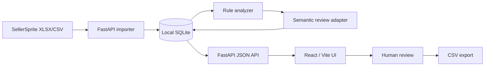

# Keyword Grove Architecture

## 目标

Keyword Grove 是一个 **local-first** 的亚马逊关键词库与广告建议工作台。核心设计目标不是自动投放，而是把 SellerSprite 等来源的关键词数据整理成可解释、可复核、可导出的建议草稿。

## 系统边界

项目不会直接连接 Amazon Ads，也不会自动执行投放、调价或否词。

## Backend

`backend/app/` 的主要职责：

- `main.py`：FastAPI 应用创建、公开路由和产品/关键词工作流编排；
- `api_support.py`：API 响应整形、查询过滤、Pydantic 兼容和人工编辑校验；
- `ai_service.py`：AI 配置读取/脱敏、OpenAI-compatible 请求、连接测试、语义审核批次并发与辅助判断；
- `importer.py`：SellerSprite 工作簿/CSV 表头识别、字段清洗、增量导入；
- `analyzer.py`：关键词相关度、核心词根与广告建议规则；
- `db.py`：SQLite 初始化、连接和持久化辅助；
- `schemas.py`：API 请求模型；
- `utils.py`：数值、货币、百分比与关键词标准化。

`main.py` 保留路由编排和事务边界，但不再直接承担 AI HTTP transport、secret-safe 配置读取或通用响应/过滤工具。这个拆分让后续继续迁移到 router/service 结构时可以逐步进行，而无需一次性改变公开 API。

语义审核把 **网络并发** 和 **本地持久化** 明确分开：独立模型批次可以使用有上限的线程池并发请求，并对单批失败做有限重试；所有 SQLite 更新仍由路由层按原始批次顺序、单线程事务写入。成功批次可以持久化，失败批次保持待审核并在响应中显式报告，不会因为一个远端请求失败就回滚或重跑已经成功的批次。

后端把数据库视为本地业务状态的唯一持久化来源。测试使用独立临时数据库，避免污染真实数据。

## Frontend

`frontend/src/` 使用 React + TypeScript + Vite：

- `api/client.ts`：后端 API 访问、分页和前端数据模型归一化；
- `api/mock.ts`：无真实数据时的演示数据；
- `components/`：产品、导入、关键词库、词根分析、AI 设置和广告建议页面；
- `types.ts`：前端领域模型。

默认 API 地址是 `http://127.0.0.1:8765/api`，可通过 `VITE_API_BASE_URL` 覆盖。

## 数据生命周期

1. 用户在本地创建产品资料；
2. 导入 SellerSprite `.xlsx` / `.xlsm` / `.csv`；
3. 导入器动态匹配字段并保留必要原始值；
4. 规则引擎给出相关度和安全优先的广告建议；
5. 可选 MiMo/OpenAI-compatible 语义审核补充理由和置信度；
6. 人工审阅、锁定或修改建议；
7. 导出 CSV 供后续人工操作。

## Trust boundaries

### AI provider

AI API Key 只存储在本地数据库，读取配置时只返回 `api_key_set` 与尾号提示。`ai_service.py` 统一负责模型请求与脱敏配置边界；语义审核是辅助判断，不能绕过规则安全边界和人工审批。并发只作用于独立的远端模型调用，且并发度有硬上限；错误摘要不得包含完整 API Key。

### Imported files

导入文件被视为不可信输入。解析逻辑应：

- 对异常数值返回 unknown/异常状态，而不是静默解释为 0；
- 允许动态表头，但不依赖列位置；
- 对重复关键词做可追踪的增量更新；
- 保留历史信息以支持审计。

### Advertising decisions

以下动作必须保持 fail-safe：

- 低相关、低搜索量或低竞品覆盖优先降级为“观察”；
- 否定词组需要比否定精准更严格的冲突判断；
- broad 只用于经过约束的产品级核心词根；
- manual lock 不能被再次导入或自动审核覆盖。

## Verification strategy

CI 分为两条独立链路：

**Backend**
- 安装依赖；
- `pip check`；
- `compileall`；
- pytest API / 导入 / 推荐规则回归测试；
- AI service 测试验证 Key 脱敏、审核 fingerprint、并发重叠和部分失败隔离。

**Frontend**
- frozen lockfile 安装；
- Vitest（不允许 0 测试通过）；
- TypeScript + Vite production build。

## 当前技术债

为保持演进透明，当前已知技术债包括：

- `backend/app/main.py` 已抽离通用 API helper 和 AI transport，但语义审核的决策应用与 CRUD 路由仍较长；下一步适合按 `products` / `keywords` / `semantic_review` 分 router/service；
- 前端大组件和单一 CSS 文件体积较大，适合按领域继续拆分；
- 现阶段测试重点覆盖高风险业务规则和 API 数据边界，UI 交互测试仍可扩展；
- SQLite 适合 local-first 单用户模式，不应直接视为多租户服务端数据库。

这些限制应在引入更复杂部署模式之前解决，而不是通过隐藏复杂度来规避。
